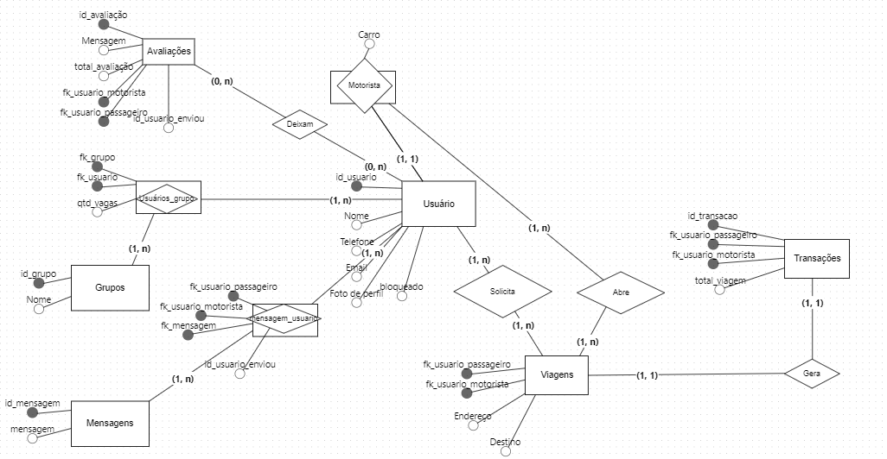
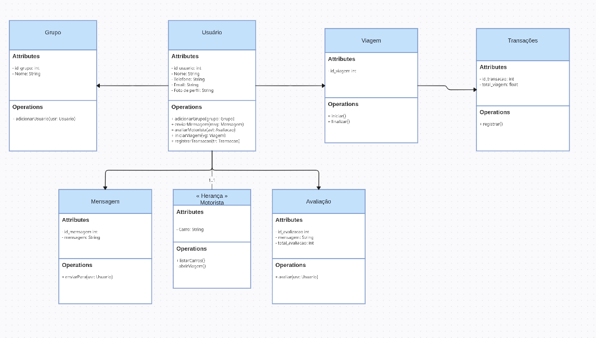
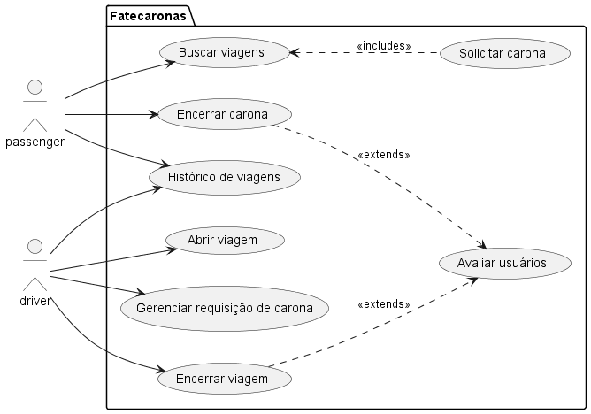
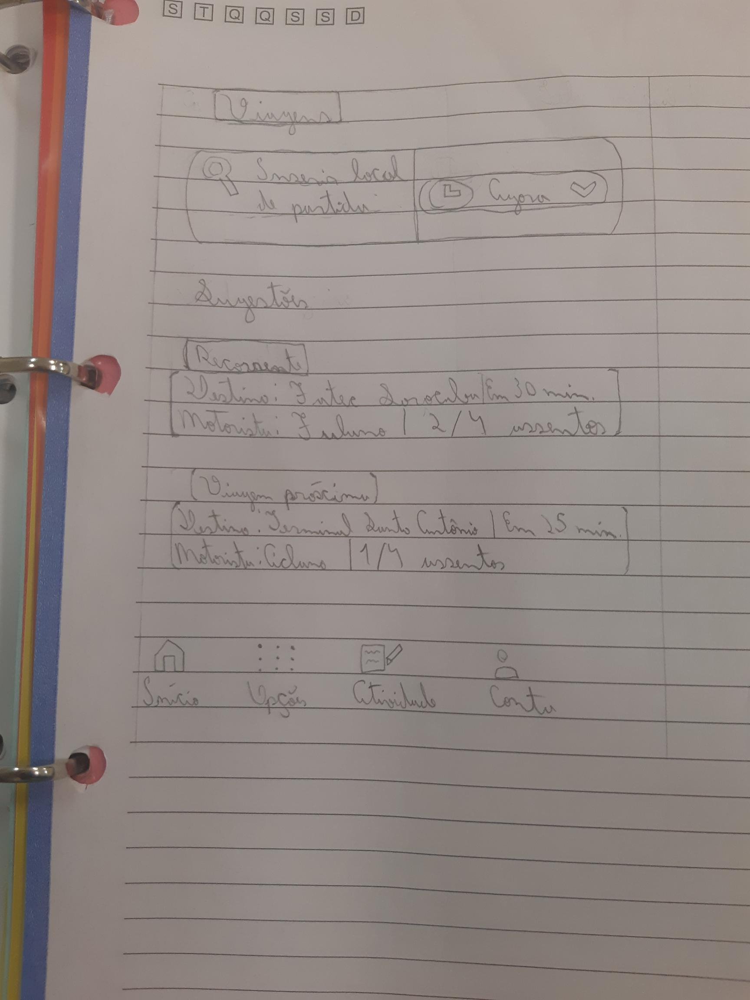

# ProjetoES2

## Autores

- &#9745; - ~~Isabela Pontes~~
- &#9745; - Luiz Miguel Jarduli Leite
- &#9745; - Vinicius de Sousa Andrade

## :car: Tema 1: Fatec Caronas

Aplicativo mobile onde alunos da Fatec Sorocaba podem oferecer ou aceitar caronas para a faculdade (ida e/ou volta).
Pensado para conectar alunos sem veículo próprio com outros alunos que queiram oferecer carona.

1. **Cadastro de Usuários:**
   - Os usuários podem se cadastrar inserindo seu RA e após verificação de identidade (garantindo que realmente são alunos).
   - Usuário escolhe entre perfil de passageiro ou motorista.

2. **Visão de passageiro**
   - Tela inicial com caronas disponíveis nas próximas 24h, mostrando número de vagas disponíveis, ponto de encontro no mapa com possibilidade de rastreio e valor em R$ da contribuição esperada.
   - Usuário pode filtrar por horário e região da cidade.
   - Usuário pode selecionar carona até 20 minutos antes do horário de partida.
   - Possibilidade de chat com o motorista para avisar em tempo real onde estão se localizando etc.

3. **Visão de motorista**
   - O motorista pode cadastrar o horário da viagem, ponto de encontro, número de vagas disponíveis e valor da contribuição de cada passageiro.
   - Motorista consente que sua localização será visível pelo mapa dos passageiros
   - Usuário pode visualizar quantas vagas foram preenchidas.

---

### :dollar: [Modelo de negócios](https://github.com/pontisa/ProjetoES2/blob/main/docs/BUSINESS_MODEL.md)

---

### 🚀 Tecnologias a serem utilizadas

- **FrontEnd** - Angular 17 (Backoffice administrativo)
- **BackEnd** - Golang
- **Mobile** - Flutter (Aplicativo Fatecaronas)
- **Banco de dados** - MySql

---

### 🥇 Nível de dificuldade do sistema proposto

> Tabelas do banco

- Transações
- Usuários
- Viagens
- Avaliações
- Comentários/Mensagens
- Grupos de usuários
- Logs

> Digrama de classes (Modelo conceitual)

> Casos de uso

- Padrões de aplicação
  - Cadastro na plataforma
  - Login na aplicação
  - Edição de perfil

- Dores de usuário
  - Buscar viagens
  - Solicitar carona
  - Encerrar carona
  - Avaliação de usuário
  - Abrir viagem
  - Gerenciar requisições de carona
  - Encerrar viagem
  - Histórico de viagens e rotas

> Relatórios

- Recibos e extrato das viagens/caronas
- Histórico geral de viagens/caronas

> Telas

- Login
- Cadastro
- Página inicial com listagem de viagens
- Página de abertura de uma viagem
- Página de solicitação de uma carona
- Menu de opções
- Tela de histórico de viagens/caronas
- Tela de extrato e recibos de pagamentos
- Tela de meu perfil & Métodos de pagamento
- Tela/Bottomsheet de avaliação do usuário

---

> Esboço da tela principal

